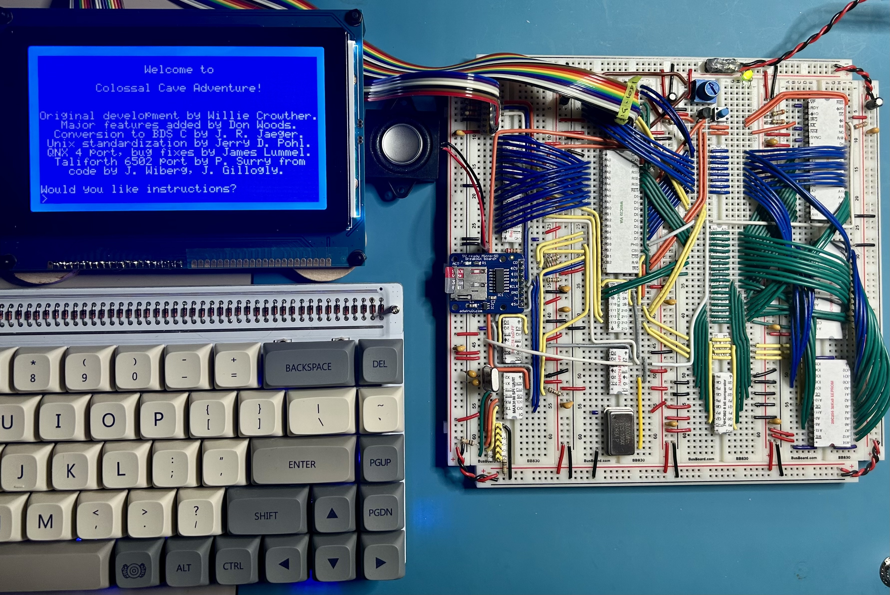
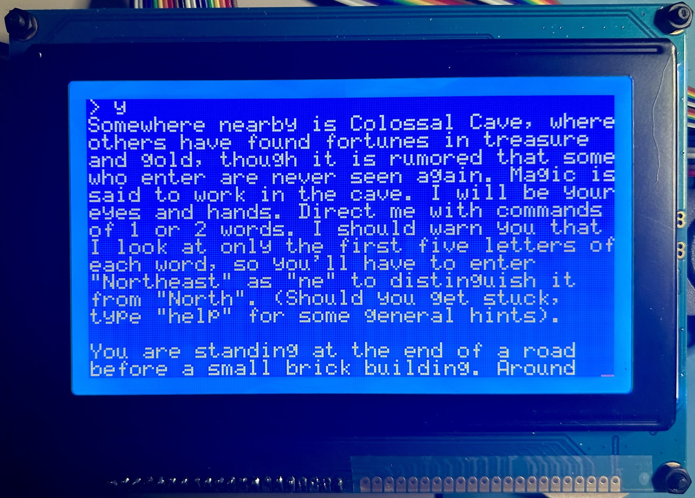
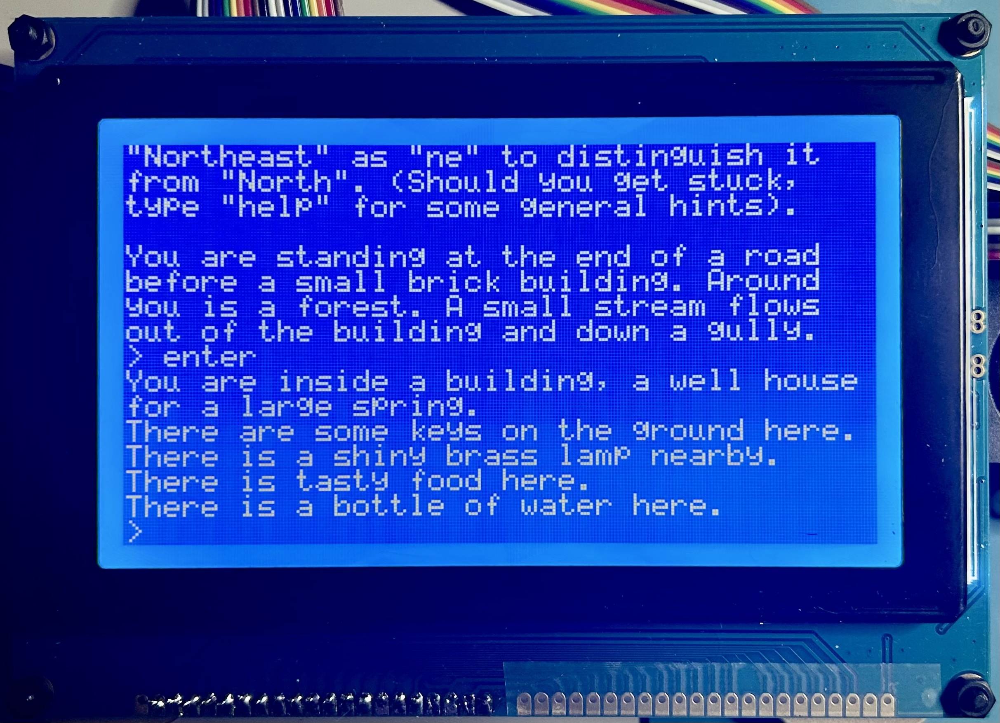

Colossal Cave Adventure for the 65C02
===

<p align="center"><em>
YOU ARE IN A MAZE OF TWISTY LITTLE PASSAGES, ALL ALIKE.
</em></p>

This is a [TaliForth][tali] port of Crowther & Wood's original 
[Colossal Cave Adventure](https://en.wikipedia.org/wiki/Colossal_Cave_Adventure) 
(350 point version) that requires only 64K to play.
You can play on real hardware like my [&micro;65c02](uc) setup (pictured), 
adapt the code for your own hardware,
or play using a 6502 simulator like [c65][c65] or [py65mon][py65].

<p align="center">
  
</p>

[tali]: https://github.com/SamCoVT/TaliForth2
[uc]: https://github.com/patricksurry/taliforth-uc
[c65]: https://github.com/patricksurry/c65
[py65]: https://github.com/mnaberez/py65

How to play
---

Skip the hardware and play on a simulator using this prebuilt
[64K memory image](data/advent.rom).
Two good options are
[py65mon][py65] which runs on python, and the C-based 
[c65][c65] which is much faster and supports external storage.
The only I/O requirement is for memory-mapped putc and getc hooks.

1. Download [`data/advent.rom`](data/advent.rom)
2. Choose a simulator:
  - build [c65][c65] (supports save/load game)
  - *or* install the [py65mon][py65] python package
3. Then play using either:
  - `c65 -r advent.rom -m 0xffe0`
  - `py65mon -m 65c02 -r advent.rom -i ffe4 -o ffe1`

To save and load games, use `c65` and create an empty block storage device before playing:
```
touch advent.blk
c65 -r advent.rom -m 0xffe0 -b advent.blk
```

You should see the startup text, rendered for a 40x16 screen.
Note that text is paged if it would exceed the 16 row screen height.
Just press a key to continue to the next page. 
There are many [resources online](https://rickadams.org/adventure/) 
to get started or get help if you're stuck.

```sh
               Welcome to                                               
                                                                        
        Colossal Cave Adventure!                                        
                                                                        
                                                                        
Original development by Willie Crowther.                                
   Major features added by Don Woods.                                   
  Conversion to BDS C by J. R. Jaeger.                                  
 Unix standardization by Jerry D. Pohl.                                 
 QNX 4 port, bug fixes by James Lummel.                                 
  Taliforth 6502 port by P. Surry from                                  
    code by J. Wiberg, J. Gillogly.                                     
                                                                        
Would you like instructions?                                            
> 
```

<p align="center">
  
</p>

If you `save` or `quit` the game, you'll drop back into Forth
where you can run Forth code, explore or modify the game itself,
or restart with `replay`.
Saving simply writes the game state to a fixed location on the current block device.
To restore your game, connect the same block device, 
start the game as usual and give the `load` command.
If you want to keep several game states just make backup copies of your block file.

```
> quit                      
Do you really want to quit now?         
> y                                     
OK                                      
      Treasures: 0                      
       Survival: 30                     
          Score: 32                     
                                    
3 2 + . 5 ok
words
...
replay
```

About the port
---

I started from 
[Wiberg's C-port](https://github.com/troglobit/adventure) 
and made some adaptations and fixes based on 
[Gillogly's earlier C-port](https://www.ifarchive.org/indexes/if-archive/games/source/)
which contains more direct translation of the original(?) FORTRAN code.
Other useful references were [Raymond's Open Adventure](https://gitlab.com/esr/open-adventure)
and the [Universal Adventure 350 Walkthrough](https://www.mipmip.org/dev/IFrescue/ajf/Universal350.html).

The main challenge was hitting the 64K target:
the original `glorkz` data file that drives
the game is already 56K before adding any logic!
Wiberg's port extracts most string data to `advent*.txt`
which together weigh in at 47K but also leaves some data in the source files.

I created some scripts to extract and reorganize the cave description,
connectivity and object data.  This is compressed using some simple preprocessing
followed by a recursive [digram coding scheme](https://en.wikipedia.org/wiki/Byte_pair_encoding).
The compression ratio is about 50% which results in the 27K
binary data file `data/advent.dat`.
The two stage decompression was straightforward to implement in assembly,
though I used a streaming approach to avoid the need for fixed size buffers in memory.
Space is tight!
See [scripts/README.md](scripts/README.md) for details.

Compression left only 37K for the Forth kernel plus the game's source code.
I used the awesome [TaliForth2][tali] project
for my kernel, but the vanilla build wants almost 24K of ROM.
I configured a "minimal" build which is stripped down to just the basics
and needs only 12K of my 16K ROM.
This left just enough space for my kernel hardware drivers
along with a few assembler routines to support the game (e.g. decompression).
This leaves a couple of pages of free ROM.

The remaining 21K RAM budget (48K less 27K of data)
was tight but doable for the game code.
The raw Forth source is nearly 64K of ascii text, but compacts to about 27K
with some pre-processing to inline constants and strip comments and excess whitespace 
(see [scripts/fpp.py](fpp.py)).
Unfortunately 27K is still too large to load both the source code and the game data at the same time.
A little dance thus ensues to build the game image.

First the source is compacted
and written to a block device image, along with the binary data file.
A tiny Forth bootloader reads the source
into high memory from the block device and compiles it,
overwriting the source as it goes, eventually using about 19K.
The data file is then loaded from the block device above the code,
aligned to the end of RAM.
This leaves the game ready to play with about 1K of free RAM.
Finally, the loader dumps a snapshot of the entire 64K memory image 
back  to the block device in order to support standalone simulator play.

<p align="center">
  
</p>

Hacking the source
---

There are a lot of moving parts here.  We currently assume the hardware
has RAM from $0-BFFF, memory-mapped hardware IO from $C000-C0FF and ROM from $C100-FFFF.
Both hardware and simulator support an external block device that
reads and writes 1K blocks.  This is required for building from source, but
a prebuilt 64K memory image is enough for playing in a simulator.

The [`micro-colossus`][uc] repo implements a 
[TaliForth2 platform](https://github.com/SamCoVT/TaliForth2/tree/master-64tass/platform) called `uc`.
To build it, download [TaliForth2][tali], pull the platform code and build:
```sh
git submodule update platform/uc
make uc CONFIG=c65
```
This generates a simulator-ready version of the Forth ROM in `taliforth-uc.bin` 
along with symbol files for debugging.
The ROM kernel initializes the hardware, 
displays a splash message and starts Forth.
The simulator code has slightly different I/O hooks
but is otherwise almost identical to the hardware version
for debugging purposes.

The `uc` platform's `platform_forth.fs` runs a turnkey routine
on startup. 
This intially points to the `block-boot` word 
which attemps to boot from block zero of an SD card 
(or binary block file in the simulator).
On successful read it verifies a magic byte pair 
and evaluates the remaining block content as Forth code.
The boot code leaves a bootstrap word on the data stack 
that will continue the loading process after we discard
the block content.

The loader for Colossal Cave is implemented in [src/boot.fs](src/boot.fs).
It loads and compiles the game source and data, 
and updates the turnkey word to the game entrypoint `play`
so that a memory snapshot will boot directly into the prebuilt game.
The loader depends on various constants calculated while preparing
the game data and injected by [scripts/advblk.py](scripts/advblk.py).
The data itself is extracted and compressed by 
[scripts/advextract.py](scripts/advextract.py)
and [scripts/advpack.py](scripts/advpack.py) 
using the compression routines in [scripts/dizzy.py](scripts/dizzy.py).

The word `play` is defined in [src/advent.fs](src/advent.fs),
built on words in the other files `src/*.fs`.
These correspond closely to the original C files with
as noted in the code.
All of the Forth source is combined and minified to 
a single file `data/advent_fpp.fs` by [scripts/fpp.py](scripts/fpp.py).
This ensures that the source code is small enough to load 
and compile, and that the compiled code is compact enough 
to leave space for the compressed game data in `data/advent.dat`.

The game has been reasonably well tested, including automated
playthroughs in `tests/excursion*.txt`.  
These compare output between the C and Forth versions 
which identified a few bugs and omissions in the C code.
For example the hint system was missing in C but added back in Forth.
A couple of remaining issues are noted in [TODO.md](TODO.md): 
pull requests are welcome.

Enjoy!